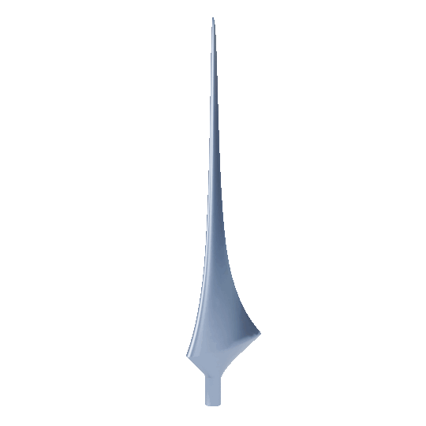
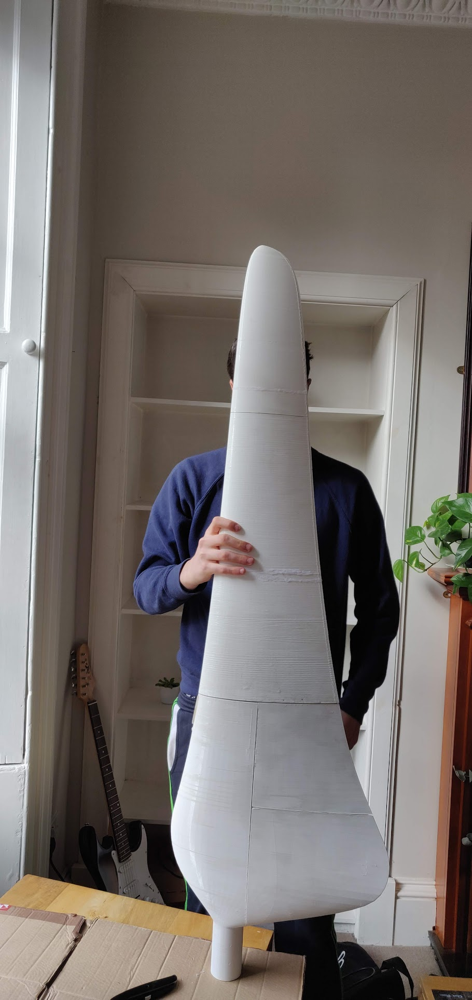
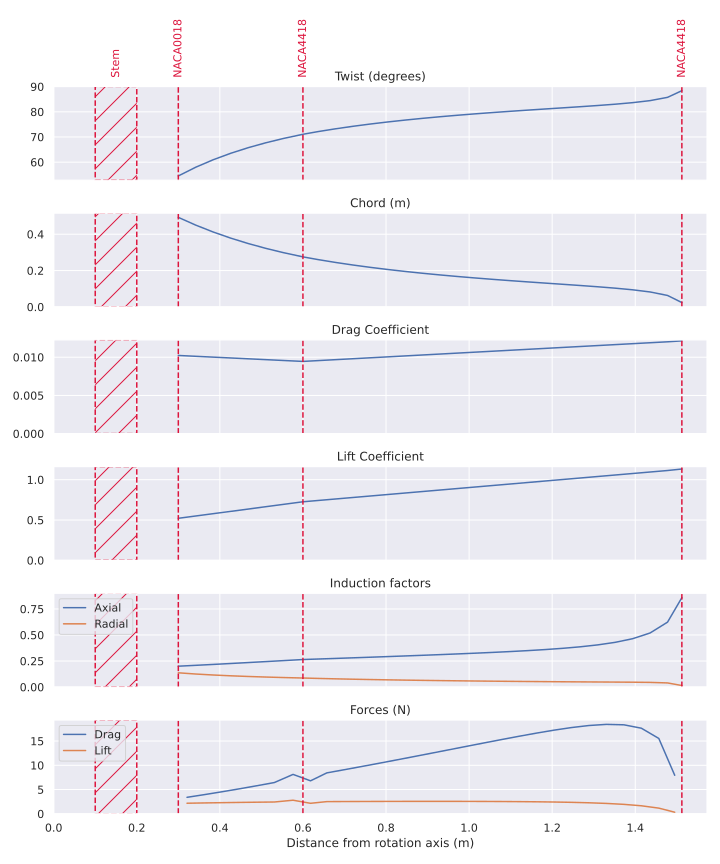

# Turbine Blade Designer
This is a Python project to design optimized wind turbine blade geometry, using the blade element momentum method.

It is based on the approach described in [this paper](https://grantingram.org/download/wind_turbine_design.pdf) by [Grant Ingram](https://grantingram.org/).

### Default blade shape

Render:



Photo of a 3d-printed blade mould
(the base was manually smoothed out in [Blender](https://www.blender.org/)):



Output plots:



## Dependencies
Requires Python 3.10 with these libraries:
- `PyYaml`
- `numpy`
- `pandas`
- [build123d](https://github.com/gumyr/build123d)
- `matplotlib`
- `seaborn` (optional, for prettier plots)

## Configuration
Parameters controlling the optimization process can be modified in `config.yaml`.
These include:

### Environment
- `free_stream_velocity`: Velocity of the incoming wind ($m.s^{-1}$)
- `fluid_density`: Density of the fluid ($kg.m^{-3}$)
- `dynamic_viscosity`: Dynamic viscosity of the fluid ($Pa.s$)

### Optimization targets
- `target_power`: Desired amount of electrical power ($W$)
- `expected_efficiency`: Total energy losses to account for (fraction)
- `tip_speed_ratio`: Target ratio of tangential tip speed vs incoming wind speed (ratio)

### Blade properties
- `blade_count`: Number of blades in the turbine (`int`)
- `slice_count`: Number of discrete slices for the blade element method (`int`)
- `sections`: Properties of the blade, defined in sections along its length. Properties will be linearly interpolated between sections.
  - `start_r`: Starting distance from the central axis ($m$) - defaults to end of the blade
  - `end_r`: Ending distance from the central axis ($m$) - defaults to starting distance
  - `airfoil`: Name of the airfoil profile to use, e.g. `NACA0018` (`str`)
  - `angle_of_attack`: Target angle of attack for the airfoil (degrees)
- `stem`: Options regarding the blade stem
  - `start`: Distance from rotation origin at which stem starts ($m$)
  - `length`: Length of the stem ($m$)
  - `diameter`: Diameter of the stem ($m$)

### Hollow geometry
- `hollow`: Optionally make the blade hollow (set to `{}` for solid blade)
  - `thickness`: Hollow shell thickness ($m$)
  - `min_chord`: Minimum chord length below which blade will become solid

## Usage
Install with `pip`, then pass a YAML config file and an output folder:
```bash
python -m pip install .
python -m python_turbine_blade_designer --input config.yaml --output output
```

This will produce the following files into the output folder:

- `blade.step` and `blade.stl`: CAD representations of the optimized blade.
- `geometry.csv` - The calculated properties of the optimized turbine blade, for each discretized slice: twist, chord length, etc.
- `forces.csv` - An estimate of the radial and axial forces experienced at each slice of the blade, under design conditions.

Additionally, the following values are outputted to `stdout`:
- Blade radius
- Ideal rotational velocity and torque (after losses)
- Expected drag force, torque, and bending torque (before losses)

And plots of this data are displayed.

> The `Blade.estimate_forces()` function can be called manually, with an optional `Environment` parameter.
> This allows calculating performance values at conditions outside the design environment.
